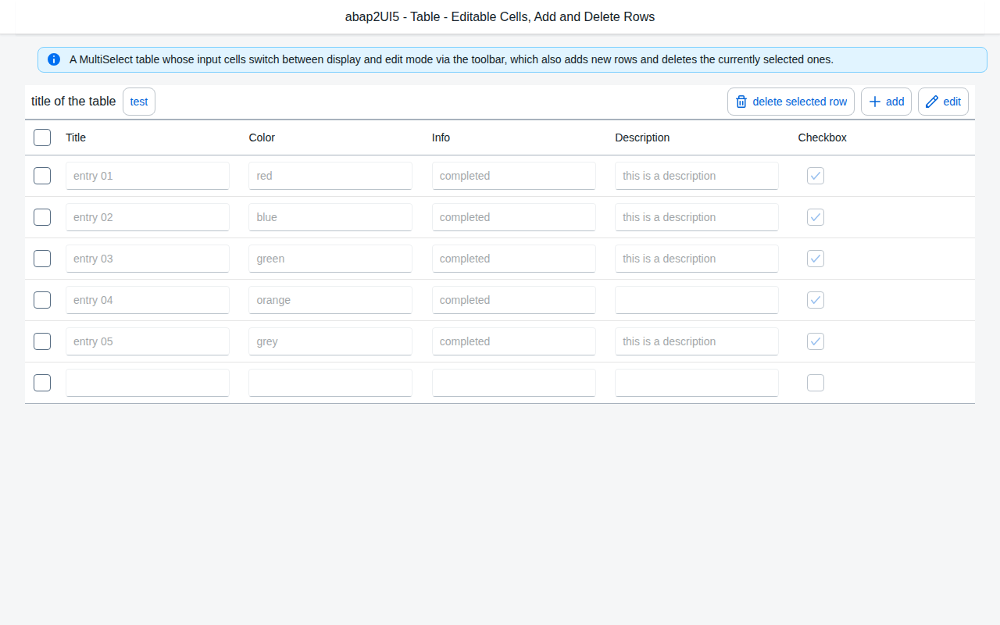
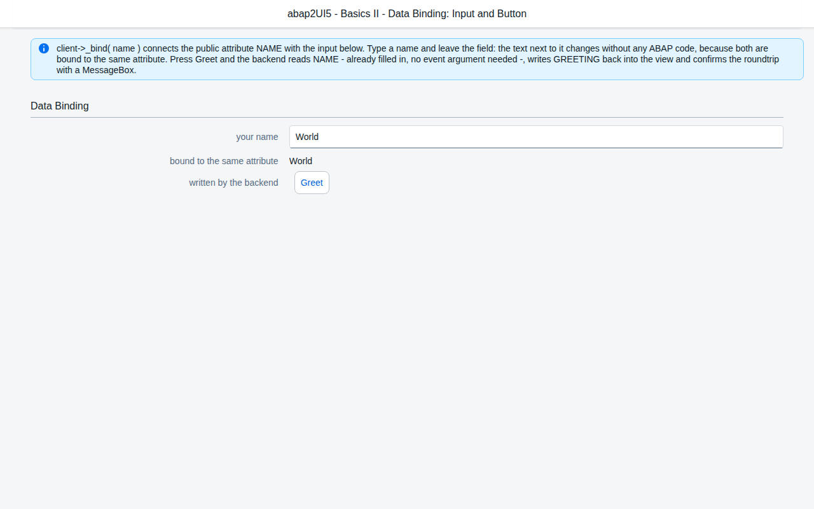
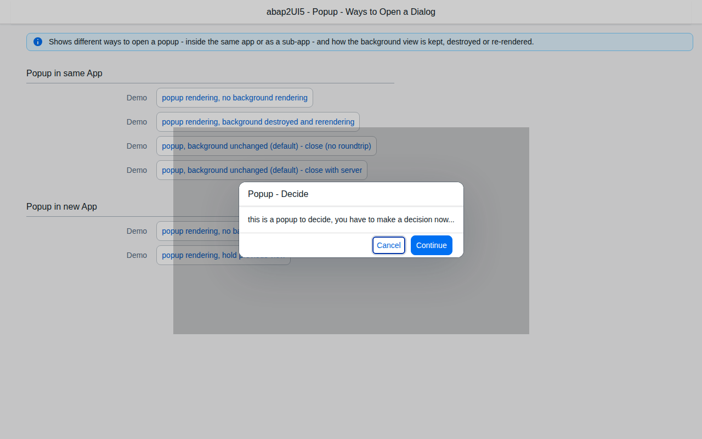
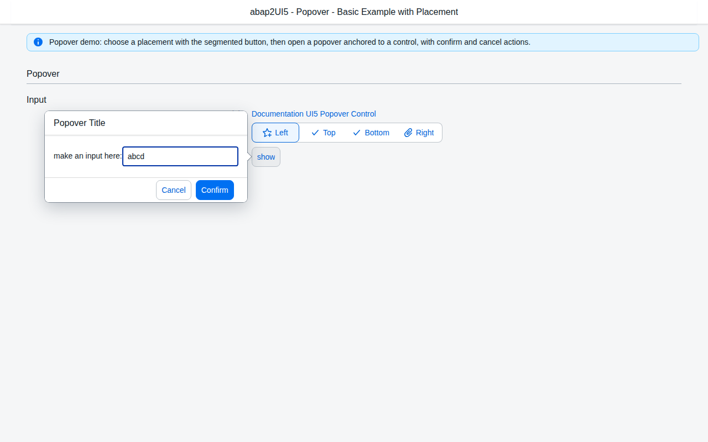
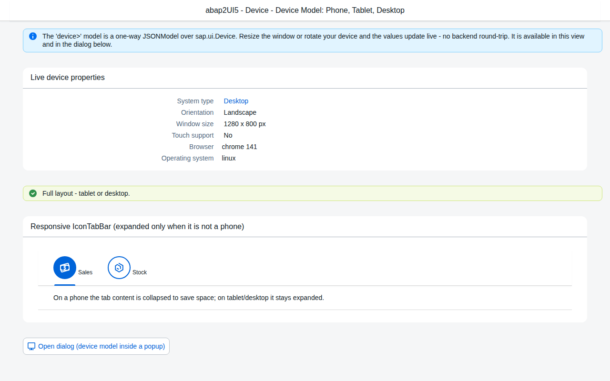
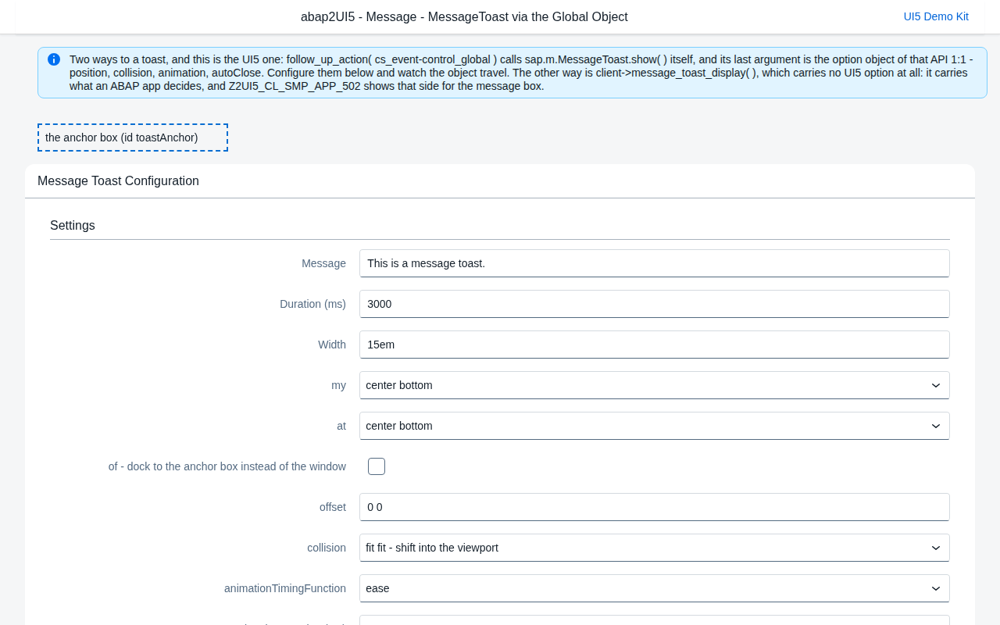
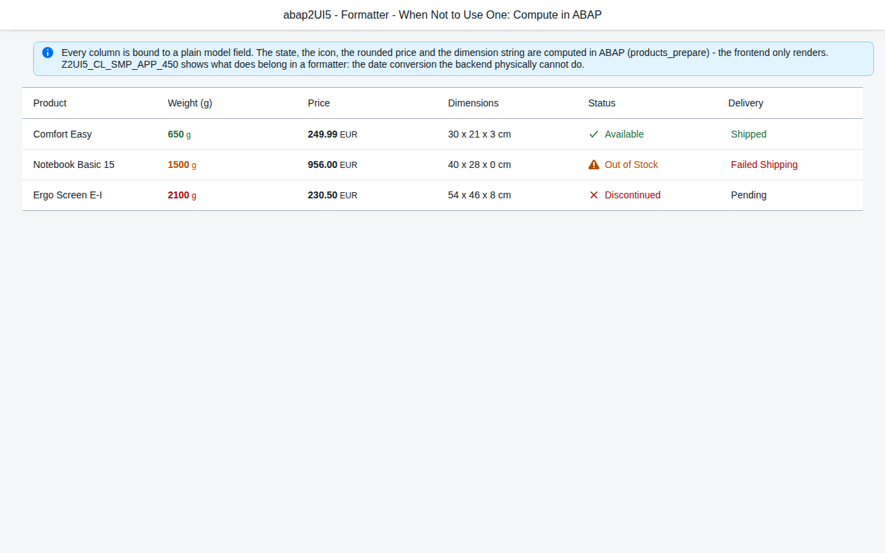

# abap2UI5 frontend - UI5 Web Components

An alternative frontend for [abap2UI5](https://github.com/abap2UI5/abap2UI5):
it speaks the same JSON protocol as the official UI5 SPA and renders the
views an unchanged abap2UI5 app class sends - with
[UI5 Web Components](https://github.com/SAP/ui5-webcomponents)
(`@ui5/webcomponents`, `@ui5/webcomponents-fiori` 2.27), **without the UI5
core**. One ES module, one custom element:

```html
<script type="module" src="abap2ui5-wc.js"></script>
<abap2ui5-app endpoint="/sap/bc/z2ui5" app="Z2UI5_CL_MY_APP"></abap2ui5-app>
```

- **standalone** - `dist/index.html` is the equivalent of the UI5 SPA's start
  page: `?app_start=<CLASS>`;
- **embedded** - in any web app (React, Vue, Angular, plain HTML): the
  element renders into its own shadow root, keeps its own backend session and
  reports what happens as DOM events.



## What it implements

The [abap2UI5 protocol](https://github.com/abap2UI5/protocol) is layered:

| Layer | Here |
|---|---|
| **Core protocol** (transport, request/response, sessions, navigation, errors) | all of it: app start, events with `T_EVENT_ARG`, the model delta of the edited paths (`__delta` rows), the draft id, the `sap-contextid` session, the CSRF token handshake, the five view slots (MAIN, NEST, NEST2, POPUP, POPOVER), the app stack (`nav_app_call` / `nav_app_leave` / the back button), the URL hash (`ROUTER` action: `KEEP`/`FRESH` routes, browser Back/Forward restores, the app-state hash, app-owned hashes with their listener event, `HASH_BACK`; see [The URL hash](#the-url-hash)), `PROTOCOL` check, the error body of a failed roundtrip shown verbatim as text |
| **Portable view profile v1** (61 controls + 4 tolerated elements, `profile/portable-v1.json`) | **65 of 65 mapped** - table below |
| full UI5 view profile | no - a control outside the portable profile renders as a visible *unsupported control* box (its children are still rendered) and is listed in the diagnostics |
| semantic profile (agent snapshot) | no - that is the MCP server's agent client |

Frontend actions (T_CUSTOM / `.eF` wires): `MESSAGE_TOAST`, `MESSAGE_BOX`
(types, details, custom actions, `onClose` event), `CONTROL_GLOBAL`
(message toast/box incl. client-composed `{0}` texts, `VIEW_SLOTS destroy` =
popup/popover close, `BUSY_INDICATOR`, `THEMING`, `INVISIBLE_MESSAGE
announce`), `SET_TITLE`, `START_TIMER`, `SET_FOCUS`, `CLIPBOARD_COPY`,
`OPEN_NEW_TAB` / `LOCATION_RELOAD` (same origin only), `URLHELPER REDIRECT`
(http(s) only), `HASH_BACK` (with its fallback route), and the navigation
family under its client-API names (`SET_PUSH_STATE`, `HASH_REPLACE`,
`HASH_ATTACH_CHANGED`, `SET_NAV_ROUTING`, `SET_APP_STATE_ACTIVE` - a backend
folds them into the `ROUTER` system action; as an `.eF` wire they reach the
router as the same options). `CONTROL_BY_ID` and `BINDING_CALL` are excluded
from the portable profile and stay unsupported. Everything else is skipped,
logged and listed in the diagnostics - never thrown.

Bindings: absolute and relative paths, list bindings with one template
(sorter, `length`, `startIndex`), element binding (`binding="{/X}"`),
two-way binding of every value-like property (the edit goes into the model
and the next event's delta, exactly as the UI5 frontend sends it), typed
bindings for display (`sap.ui.model.type` / `odata.type` Integer, Float,
Decimal, Date, Time, DateTime, Currency with `formatOptions` such as
`decimals`, `pattern`, `source.pattern`) and back (numbers stay numbers),
expression bindings in the profile's grammar (`${...}`, operators, `? :`,
`.length`, `Math.max/min/abs/round/floor/ceil`, `toUpperCase/toLowerCase/
trim/indexOf/includes/startsWith/endsWith`) evaluated by a small parser - no
`eval` -, composite text and `parts`, the `device>` model, and the profile's frontend
formatters `Formatter.DateCreateObject`, `Formatter.DateAbapDateToDateObject`
and `Formatter.DateAbapDateTimeToDateObject` (ABAP DATS/TIMS or ISO strings
to dates, e.g. for `DatePicker.dateValue`, `minDate`, `maxDate`; same names and
behaviour as the UI5 frontend's `model/formatter.js`). Any other formatter
renders a visible `[formatter name]` placeholder and is reported. Tables and
lists grow: `growing` / `growingThreshold` / `growingTriggerText` /
`growingScrollToLoad` render the first rows and a "More" trigger.

## Embedding

The bundle registers `<abap2ui5-app>`; give the element a height.

```html
<!-- plain HTML -->
<script type="module" src="/assets/abap2ui5-wc.js"></script>
<abap2ui5-app endpoint="/sap/bc/z2ui5" app="Z2UI5_CL_MY_APP" style="height: 600px"></abap2ui5-app>
<script>
  document.querySelector('abap2ui5-app')
    .addEventListener('abap2ui5-message', (e) => console.log(e.detail));
</script>
```

```jsx
// React 19 (custom elements are first-class; React 18: addEventListener in a ref effect)
import '@abap2ui5/frontend-webcomponent';
export const Abap2UI5 = ({ app }) => (
  <abap2ui5-app endpoint="/sap/bc/z2ui5" app={app} style={{ display: 'block', height: 600 }} />
);
```

```vue
<!-- Vue 3 - compilerOptions.isCustomElement: (t) => t === 'abap2ui5-app' -->
<script setup>import '@abap2ui5/frontend-webcomponent';</script>
<template>
  <abap2ui5-app endpoint="/sap/bc/z2ui5" :app="app" style="display:block;height:600px"
                @abap2ui5-message="onMessage" />
</template>
```

Angular: add `CUSTOM_ELEMENTS_SCHEMA` to the component and import the module
once. [`examples/plain.html`](examples/plain.html) runs two apps side by side
(the demo server serves it at `/examples/plain.html`),
[`examples/react.jsx`](examples/react.jsx) and
[`examples/vue.vue`](examples/vue.vue) are the snippets above in full.

| Attribute | |
|---|---|
| `endpoint` | the abap2UI5 HTTP service (`/sap/bc/z2ui5`, or an absolute URL) |
| `app` | the app class; changing it restarts the element with that app |
| `params` | extra start parameters, `a=1&b=2` (they travel in `SEARCH`) |
| `theme` | a UI5 Web Components theme: `sap_horizon` (default), `sap_horizon_dark`, `sap_horizon_hcb`, `sap_fiori_3`, ... |
| `credentials` | fetch credentials: `same-origin` (default), `include` (a backend on another origin, cookie auth), `omit` |
| `csrf` | `auto` (default: fetch a token when a token layer answers 403 `X-CSRF-Token: Required`, re-send once), `fetch` (before the first POST), `none`, or a token |
| `diagnostics` | `off` hides the diagnostics panel (the console and the events still report) |
| `document-title` | `SET_TITLE` also sets `document.title` (always on in the standalone page) |
| `standalone` | the element owns the page: the URL hash is the app's (routes, app state, Back/Forward) and travels with every request |
| `routing` | the URL hash: `hash` (read and write the page's hash - the default with `standalone`), `events` (never touch the host's URL, emit `abap2ui5-route` - the default embedded), `off` |

Properties: `headers` (extra request headers - `Authorization`, `sap-client`),
`transport` (your own `{ roundtrip(body), endSession() }`), `session`,
`diagnostics`; methods `restart()`, `navigate(hash)`. Events (bubbling,
composed): `abap2ui5-response`, `abap2ui5-request`, `abap2ui5-message`,
`abap2ui5-title`, `abap2ui5-error`, `abap2ui5-diagnostic`,
`abap2ui5-route`.

### The URL hash

abap2UI5 apps can keep their state in the URL hash
([spec/navigation.md](https://github.com/abap2UI5/protocol/blob/main/spec/navigation.md)):
hash routing (`#/app/<CLASS>/<DRAFT>` in mode `KEEP`, `#/app/<CLASS>` in
`FRESH`; a `nav_app_call` pushes a history entry, the browser Back button
restores the caller's draft), the app-state hash
(`#/z2ui5-xapp-state=<DRAFT>`: reload and bookmarks restore the state), and
app-owned hashes (`hash_set` / `hash_replace` with a listener event raised
on Back/Forward, `HASH_BACK` with a fallback route). The backend sends what
the URL has to reflect as the `ROUTER` system action; this frontend applies
it once per response, as the UI5 frontend's router does.

- **Standalone** (`dist/index.html`, or `routing="hash"`): the page's hash is
  the app's. It is written with the History API, a browser Back/Forward or a
  manual edit sends the app-start-shaped restore request (no `ID`, the new
  `HASH`), and every request carries the hash as `S_FRONT.HASH`. Inside the
  SAP Fiori launchpad the shell part before `&/` is kept.
- **Embedded** (the default without `standalone`): the hash is the host's.
  The element never reads or writes `location`, sends no `HASH`, and tells
  the host instead - an `abap2ui5-route` event per hash the app would
  write, `{ action: 'push' | 'replace', hash, app, id }`, and
  `{ action: 'back' }` for `HASH_BACK`. A host that routes itself can record
  those hashes and, on its own Back button or a deep link, hand one back with
  `element.navigate(hash)`: a route then restores that draft, an app-owned
  hash raises the app's listener event - and that one request carries the
  hash. `routing="off"` ignores the `ROUTER` action altogether.

The protocol client, the renderer and the control registry are exported too
(`Session`, `createFetchTransport`, `Renderer`, `defineControl`, ...), and
`defineControl('z2ui5.cc.MyControl', mapper)` adds a mapper of your own.

## Run the demo

The demo backend is abap2UI5 itself, transpiled to Node -
[`@abap2ui5/node-runtime`](https://www.npmjs.com/package/@abap2ui5/node-runtime)
1.146.0 - with 16 real sample apps of
[abap2UI5/samples](https://github.com/abap2UI5/samples) transpiled on top,
exactly as the package's README describes for your own apps.

```bash
npm ci
npm run demo:build   # open-abap-core at the runtime's commit, transpile demo/abap, abap2ui5-own-apps
npm run build        # dist/abap2ui5-wc.js, dist/index.html
npm run demo:serve   # http://127.0.0.1:4300/?app_start=Z2UI5_CL_SMP_APP_494
```

The same server answers the official UI5 SPA at
`http://127.0.0.1:4300/sap/bc/z2ui5/?app_start=Z2UI5_CL_SMP_APP_494` - one
backend, two frontends.

| Demo app | | Status |
|---|---|---|
| Z2UI5_CL_SMP_APP_493 | Hello World - Shell, Page, MessageStrip, Title | runs fully |
| Z2UI5_CL_SMP_APP_494 | Data binding - two-way binding, delta, MessageBox | runs fully |
| Z2UI5_CL_SMP_APP_381 | MessageToast via the global object - Select, CheckBox, toast options, onClose event, client-composed toast | runs fully (toast position options are not applied) |
| Z2UI5_CL_SMP_APP_382 | MessageBox types, details, custom actions | runs fully |
| Z2UI5_CL_SMP_APP_011 | Table - edit mode, cell inputs, MultiSelect, delete and add rows | runs fully |
| Z2UI5_CL_SMP_APP_019 | Table selection modes - SegmentedButton, selection read in ABAP | runs fully |
| Z2UI5_CL_SMP_APP_048 | List - StandardListItem, `${ROW}` args on detailPress, selectionChange | runs fully |
| Z2UI5_CL_SMP_APP_012 (+020) | Popups - dialog over the page, popup closed on the client, popup app via nav_app_call | runs fully |
| Z2UI5_CL_SMP_APP_026 | Popover at its opener, input and footer | runs fully |
| Z2UI5_CL_SMP_APP_024 (+025) | Navigation - call another app, return data, back button | runs fully |
| Z2UI5_CL_SMP_APP_445 | Device model - `device>` bindings, expressions, IconTabBar, popup | runs fully |
| Z2UI5_CL_SMP_APP_125 | Set the tab title (SET_TITLE) | runs fully |
| Z2UI5_CL_SMP_APP_027 | Expression binding, types, composite parts | partial: the `RegExp(...)` expression is outside the profile - reported, the button stays disabled |
| Z2UI5_CL_SMP_APP_453 | ObjectStatus, ObjectNumber in a table | runs fully |
| Z2UI5_CL_SMP_APP_480 (+469) | Hash routing (KEEP) - `#/app/<CLASS>/<DRAFT>`, nav_app_call pushes, browser Back/Forward restore the drafts | runs fully |
| Z2UI5_CL_SMP_APP_498 | App state in the URL - `#/z2ui5-xapp-state=<DRAFT>`, a reload restores the state | runs fully (the share link is the backend's) |

<p>






</p>

All screenshots: [`docs/screenshots/`](docs/screenshots).

## Tests

```bash
npm run lint
npm test            # node:test - bindings, expressions, types, the protocol client
                    # (delta, slots, errors, busy queue), transport (contextid, CSRF),
                    # the URL hash router, frontend actions (both shapes of the
                    # profile's action list), formatters, the renderer on happy-dom over the recorded
                    # views of every demo app, the vendored-file hashes, profile coverage
npm run e2e         # Playwright - every demo app in the web-components frontend,
                    # DOM + backend state, and the same interaction in the UI5 SPA
                    # with the request bodies / models compared; embedding; errors
npm run screenshots # docs/screenshots/
```

The e2e cross-check drives the official UI5 SPA through the UI5 control API
(`setValue` + `fireChange`, `firePress`, ...) and compares what both
frontends sent (`EVENT`, `T_EVENT_ARG`, `MODEL`) and what the backend answered.
UI5 itself comes from `sdk.openui5.org`; `OPENUI5_DIR=<node_modules/@openui5>`
serves it from local packages instead (offline sandboxes), `CROSS_CHECK=0`
skips the UI5 half. Chromium: `CHROMIUM_BIN`, else `/opt/pw-browsers/chromium`
when present, else Playwright's own.

## Architecture

```
src/core/       the protocol client - no DOM
  session.js      start / fire / closeSlot, response adoption (vendored applyResponse),
                  delta (vendored buildDelta), app stack, APP-change popup teardown, busy queue,
                  route restore, the error body verbatim
  transport.js    fetch POST { value }, sap-contextid, CSRF handshake, terminate HEAD
  router.js       the URL hash: ROUTER sync, routes, app-state hash, app-owned hashes,
                  HASH_BACK - on the page's hash or as abap2ui5-route events (embedded)
  actions.js      T_CUSTOM / eF frontend actions
src/bindings/   model.js (long-lived models, edited paths, device>), binding.js (property and
                list bindings), expression.js (profile grammar), types.js (typed display),
                formatters.js (the profile's Formatter.Date*), objectsyntax.js
src/render/     renderer.js (XML -> elements, scopes, two-way, wires), wires.js (event args),
                registry.js + controls/*.js (one mapper per UI5 control), webcomponents.js (imports)
src/ui/         app.js (slots, popups, toast/box, busy, errors, diagnostics), styles.js
src/element.js  <abap2ui5-app>
src/vendor/agent/  viewxml.mjs, snapshot.mjs, appclient.mjs of abap2UI5/mcp-server, unchanged
```

The XML parser, the wire parser, the response bookkeeping and the delta
builder are the MCP server's agent client modules, **vendored unchanged** at
a recorded commit (`scripts/vendor-agent.mjs`, `src/vendor/agent/source.json`,
hash test) - the same code that already speaks the protocol for agents;
the bundler drops what the browser does not call.

Bundle (`npm run build`): `dist/abap2ui5-wc.js` **1265 kB raw / 263 kB gzip**
loaded up front (the 62 web components used, nothing else); on demand, in
`dist/chunks/`: the SAP icon collection (248 kB gzip, on the first icon),
popover internals, the CLDR data of the user's locale, extra themes.

## Control coverage

<!-- coverage:start (generated by scripts/generate-coverage.mjs) -->
Portable profile v1: **65 of 65** controls mapped (42 full, 23 basic).

| UI5 control (profile v1) | rendered as | status | basic: what is left out |
|---|---|---|---|
| sap.m.Page | `ui5-page` + `ui5-bar` header/footer | full |  |
| sap.m.Shell | HTML/CSS | full |  |
| sap.m.VBox | HTML/CSS | full | CSS flexbox: direction, alignItems, justifyContent, wrap, fitContainer; FlexItemData grow/shrink/base |
| sap.ui.layout.form.SimpleForm | CSS grid + `ui5-title` | basic | label/field grid with group titles; layout, columns and breakpoints are not modelled |
| sap.m.HBox | HTML/CSS | full | CSS flexbox: direction, alignItems, justifyContent, wrap, fitContainer; FlexItemData grow/shrink/base |
| sap.m.Panel | `ui5-panel` | full |  |
| sap.ui.layout.Grid | HTML/CSS | basic | defaultSpan and GridData span (XL/L/M/S); no indent |
| sap.m.FlexBox | HTML/CSS | full | CSS flexbox: direction, alignItems, justifyContent, wrap, fitContainer; FlexItemData grow/shrink/base |
| sap.m.ScrollContainer | HTML/CSS | full |  |
| sap.m.IconTabFilter | `ui5-tab` | full |  |
| sap.m.IconTabBar | `ui5-tabcontainer` + `ui5-tab` | basic | tabs with text, icon, count, iconColor and content; selectedKey, select; no expand/collapse event, no drag & drop |
| sap.ui.layout.VerticalLayout | HTML/CSS | basic | a column of its content; width/spacing not modelled |
| sap.ui.core.Title | `ui5-title` | basic | icon not shown |
| sap.ui.layout.HorizontalLayout | HTML/CSS | basic | an inline row of its content; allowWrapping always on |
| sap.m.OverflowToolbar | `ui5-toolbar` (+ `ui5-toolbar-button`, `-item`, `-spacer`, `-separator`) | full |  |
| sap.m.ToolbarSpacer | `ui5-toolbar-spacer` | full |  |
| sap.m.Toolbar | `ui5-toolbar` (+ `ui5-toolbar-button`, `-item`, `-spacer`, `-separator`) | full |  |
| sap.m.Bar | `ui5-bar` | full |  |
| sap.m.OverflowToolbarButton | `ui5-button` | basic | icon button with the text as tooltip (the overflow text is the toolbar's) |
| sap.m.Text | `ui5-text` | full |  |
| sap.m.Label | `ui5-label` | full |  |
| sap.m.Title | `ui5-title` | full |  |
| sap.m.ObjectStatus | styled `<span>` + `ui5-icon` | basic | icon, title, text, state, inverted, active; no stateAnnouncementText |
| sap.m.Link | `ui5-link` | full |  |
| sap.m.ObjectIdentifier | HTML (+ `ui5-link` when titleActive) | basic | title, text, titleActive/titlePress |
| sap.ui.core.HTML | HTML/CSS | basic | content sanitized: no script, no event handlers |
| sap.ui.core.Icon | `ui5-icon` | full |  |
| sap.m.ObjectNumber | HTML/CSS | basic | number, unit, state, emphasized |
| sap.tnt.InfoLabel | `ui5-tag` + `ui5-icon` | full |  |
| sap.m.ProgressIndicator | `ui5-progress-indicator` | full |  |
| sap.m.Image | HTML `` | full |  |
| sap.m.Input | `ui5-input` + `ui5-icon` | full |  |
| sap.m.TextArea | `ui5-textarea` | full |  |
| sap.ui.core.Item | `ui5-option` + `ui5-cb-item` + `ui5-mcb-item` | full |  |
| sap.m.CheckBox | `ui5-checkbox` | full |  |
| sap.m.Switch | `ui5-switch` | full |  |
| sap.m.SegmentedButton | `ui5-segmented-button` | full |  |
| sap.m.SegmentedButtonItem | `ui5-segmented-button-item` | full |  |
| sap.m.Select | `ui5-select` | full |  |
| sap.m.DatePicker | `ui5-date-picker` | basic | value (two-way), valueFormat, displayFormat, minDate/maxDate; dateValue one-way (from a frontend formatter) |
| sap.m.SearchField | `ui5-input` + `ui5-icon` | full |  |
| sap.m.ComboBox | `ui5-combobox` | full |  |
| sap.m.MultiInput | `ui5-multi-input` | basic | tokens are shown; a token delete fires tokenUpdate but is not written back into the bound token table (UI5 needs z2ui5.cc.MultiInputExt for that too) |
| sap.m.Token | `ui5-token` | basic | text, key, selected |
| sap.m.MultiComboBox | `ui5-multi-combobox` | full |  |
| sap.m.StepInput | `ui5-step-input` | full |  |
| sap.ui.core.ListItem | `ui5-option` + `ui5-cb-item` + `ui5-mcb-item` | full |  |
| sap.m.DateTimePicker | `ui5-datetime-picker` | basic | value (two-way), valueFormat, displayFormat, minDate/maxDate; dateValue one-way (from a frontend formatter) |
| sap.m.Button | `ui5-button` (`ui5-toolbar-button` in a toolbar) | full |  |
| sap.m.ToggleButton | `ui5-toggle-button` | full |  |
| sap.m.Column | `ui5-table-header-cell` | basic | header, width, hAlign, minScreenWidth; no demandPopin/footer |
| sap.m.ColumnListItem | `ui5-table-row` + `ui5-table-cell` | basic | cells, type (interactive rows), selected, press; highlight not shown |
| sap.m.Table | `ui5-table` (+ header row/cells, `ui5-table-selection-multi`/`-single`) | basic | columns, items (bound or static), header toolbar, noDataText, MultiSelect/SingleSelect via the selected binding, itemPress, selectionChange, growing (threshold, trigger text, scroll to load); no Delete mode, no grouping |
| sap.m.List | `ui5-list` | basic | items (bound or static), headerText, mode, itemPress, selectionChange, delete, growing (threshold, trigger text, scroll to load); no grouping |
| sap.m.StandardListItem | `ui5-li` | basic | title, description, icon, info, infoState, highlight, type, selected; no counter/avatar |
| sap.m.CustomListItem | `ui5-li-custom` | full |  |
| sap.m.Tree | `ui5-tree` | basic | nested array binding, headerText, mode, headerToolbar, toggleOpenState/itemPress/selectionChange |
| sap.m.StandardTreeItem | `ui5-tree-item` | full |  |
| sap.m.Dialog | `ui5-dialog` + `ui5-bar` footer | basic | title, icon, state, content size, buttons/begin/endButton/footer, custom header, afterClose; type Message not distinguished |
| sap.m.Popover | `ui5-popover` | basic | title, placement, modal, content size, footer, afterClose |
| sap.m.MessageStrip | `ui5-message-strip` | full |  |
| sap.ui.core.CustomData (tolerated) | none (no UI) | full | tolerated, no UI |
| sap.m.FlexItemData (tolerated) | none (no UI) | full | applied to the parent control as CSS flex |
| sap.ui.layout.GridData (tolerated) | none (no UI) | full | applied to the parent control as grid span |
| sap.m.OverflowToolbarLayoutData (tolerated) | none (no UI) | full | tolerated, no UI |

Beyond v1 (31):

| UI5 control | rendered as | status | basic: what is left out |
|---|---|---|---|
| sap.m.ActionListItem | `ui5-li` | full |  |
| sap.m.App | HTML/CSS | full |  |
| sap.m.Avatar | `ui5-avatar` | basic |  |
| sap.m.BusyIndicator | `ui5-busy-indicator` | full |  |
| sap.m.DateRangeSelection | `ui5-daterange-picker` | basic | value only (no dateValue/secondDateValue) |
| sap.m.DisplayListItem | `ui5-li` | full |  |
| sap.m.FormattedText | HTML/CSS | basic | sanitized HTML; no controls aggregation |
| sap.m.GenericTag | `ui5-tag` | basic |  |
| sap.m.GroupHeaderListItem | `ui5-li` | basic |  |
| sap.m.IconTabSeparator | `ui5-tab-separator` | full |  |
| sap.m.MaskInput | `ui5-input` | basic | a plain input: the mask is shown as placeholder, not enforced |
| sap.m.NavContainer | HTML/CSS | basic | shows the initial (or first) page; to() by CONTROL_BY_ID is not supported |
| sap.m.ObjectAttribute | `ui5-link` | basic |  |
| sap.m.ObjectHeader | `ui5-title` | basic | title, number, attributes and statuses; no intro, icon, markers |
| sap.m.ObjectListItem | `ui5-li` | basic | title, intro, number, icon; attributes and statuses are not shown |
| sap.m.RadioButton | `ui5-radio-button` | full |  |
| sap.m.RadioButtonGroup | HTML/CSS | full |  |
| sap.m.RatingIndicator | `ui5-rating-indicator` | full |  |
| sap.m.ResponsivePopover | `ui5-popover` | basic | as Popover (no phone-fullscreen variant) |
| sap.m.Slider | `ui5-slider` | full |  |
| sap.m.SuggestionItem | HTML/CSS | basic |  |
| sap.m.TimePicker | `ui5-time-picker` | basic |  |
| sap.m.ToolbarSeparator | `ui5-toolbar-separator` | full |  |
| sap.ui.core.FragmentDefinition | HTML/CSS | full |  |
| sap.ui.core.InvisibleText | none (no UI) | full |  |
| sap.ui.core.SeparatorItem | `ui5-option` | basic |  |
| sap.ui.core.mvc.View | HTML/CSS | full |  |
| sap.ui.core.mvc.XMLView | HTML/CSS | full |  |
| sap.ui.layout.form.Form | CSS grid + `ui5-title` | basic |  |
| sap.ui.layout.form.FormContainer | `ui5-title` | basic |  |
| sap.ui.layout.form.FormElement | `ui5-label` | basic |  |
<!-- coverage:end -->

"basic" = the members listed are rendered; any other property of the control
is accepted, ignored and logged (`property:` in the console), as the profile
requires.

## Limits

- **Not rendered:** controls outside the portable profile (sap.ui.table,
  sap.f, sap.uxap, sap.ui.comp, z2ui5.cc custom controls, ...) - visible box +
  diagnostics; formatter functions other than the profile's `Formatter.Date*`;
  named models other than `device>`; XML templating (`template:repeat`);
  `CONTROL_BY_ID` calls and `BINDING_CALL` (excluded from the portable
  profile); `prevent_default_expr`; expressions outside the profile grammar
  (`RegExp`, `odata.*`).
- **Frontend actions the profile allows but this frontend does not run yet**
  (skipped and reported): `DOWNLOAD_B64_FILE`, `SCROLL_TO`,
  `SCROLL_INTO_VIEW`, `SET_FAVICON`, `SYSTEM_LOGOUT`, `STORE_DATA`,
  `KEYBOARD_SHORTCUT`, `PLAY_AUDIO`, `SET_SIZE_LIMIT` (the last one MAY be a
  no-op).
- **Deviations from the UI5 rendering:** SimpleForm is a two-column CSS grid
  (Label opens a row, Title opens a group) rather than `ui5-form`;
  MessageToast position options are ignored; `DatePicker.dateValue` is
  one-way (a formatter binding, as in UI5 - the edit travels through
  `value`); growing renders on the client (all rows are in the model, as with
  UI5's JSON model).
- **NEST/NEST2** (profile v1.1) are rendered into the MAIN control the
  display names, appended to its content.
- **Backend concurrency:** the e2e tests run with one worker - the transpiled
  framework in `@abap2ui5/node-runtime` keeps request state in static
  attributes, and two roundtrips interleaving in one Node process were seen
  to read each other's app data.

## Development

- `npm run vendor -- /path/to/mcp-server [--ref <sha>]` re-vendors the agent
  modules; `npm run vendor:check` verifies them.
- `node scripts/vendor-profile.mjs /path/to/protocol [--ref <rev>]` re-copies
  `profile/portable-v1.json` (default `origin/main`) and records the commit in
  `profile/source.json`.
- `node scripts/vendor-samples.mjs /path/to/samples` re-copies the demo apps
  listed in `demo/apps.json`; `node scripts/record-fixtures.mjs` re-records the
  views the renderer unit tests render.
- `node scripts/generate-coverage.mjs` regenerates the table above (`npm test`
  fails when it is stale).

See [AGENTS.md](AGENTS.md) for the repository rules and
[CHANGELOG.md](CHANGELOG.md) for the history.

## License

MIT
